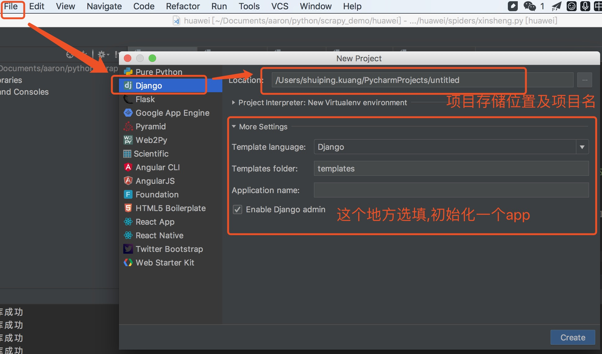
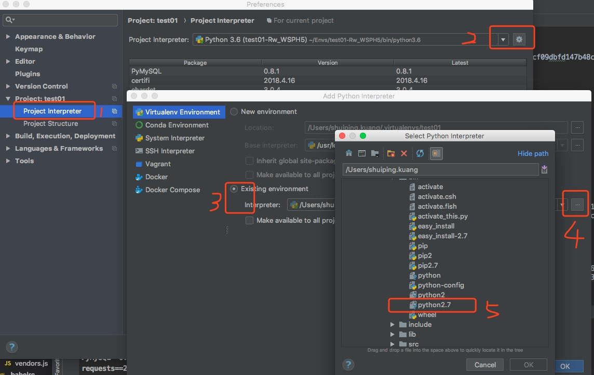
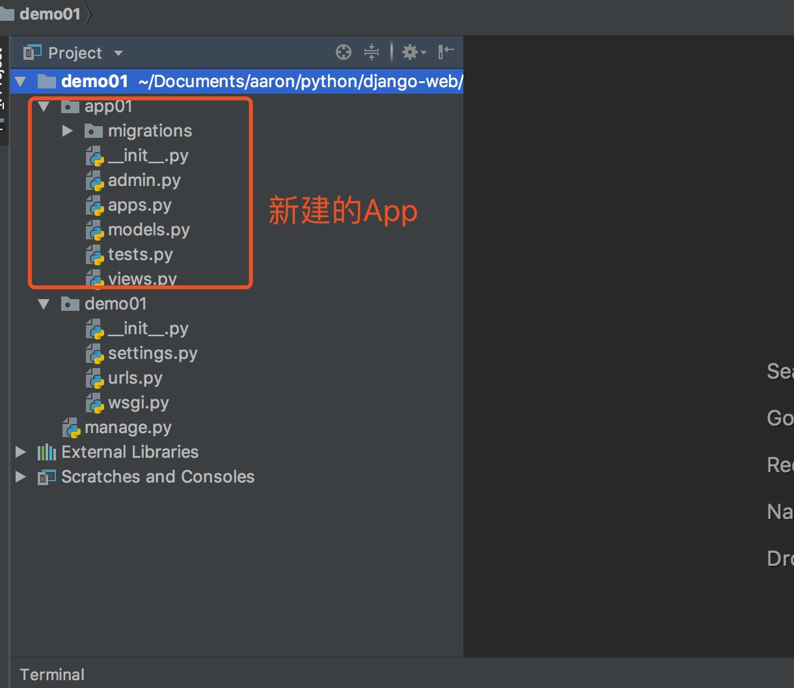

## <center>django项目的搭建</center>

### 一、通过命令行创建`django`项目

* 1、新建一个文件夹(项目名)
* 2、使用`pipenv`创建开发环境

  ```py
  pipenv install -- python 3.6 
  pipenv install django

  (django-web-t2iS-ezr) ➜  django-web pip list
  Package    Version
  ---------- -------
  Django     2.0.6  
  pip        10.0.1 
  pytz       2018.5 
  setuptools 39.2.0 
  wheel      0.31.1 
  (django-web-t2iS-ezr) ➜  django-web 
  ```

* 3、创建`django`项目

  ```py
  django-admin startproject 项目名
  ```

### 二、使用`pycharm`创建`django`项目

* 1、直接看图更清楚
  


### 三、指定开发环境



### 四、新建`django`项目目录(自己创建了一个`app`)



