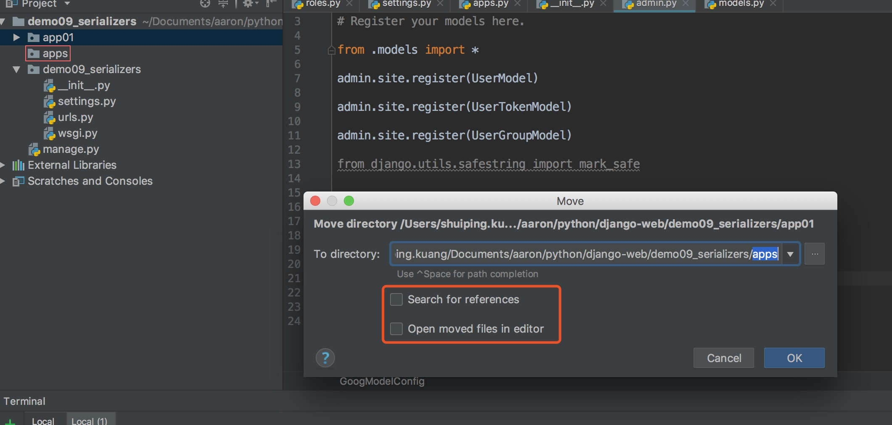
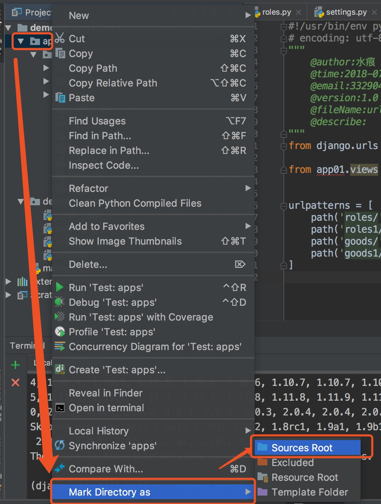

## <center>django开发中app统一管理</center>

### 一、使用场景
> 在实际项目开发过程中或许有很多个`app`,我们将`app`归拢到一个文件夹下统一管理

* 1、将我们创建的`app`拖动到`apps`的文件夹下,注意下面两个地方不要点击勾选

  

* 2、设置根目录(<font color="#f00">刚刚移动后的文件是会报错的</font>)

  

* 3、上面设置了根目录(只能是`pycharm`可以识别,但是我们使用命令行启动就不能识别,需要在`settings.py`中配置)

  ```py
  import os
  # 引入包
  import sys

  # Build paths inside the project like this: os.path.join(BASE_DIR, ...)
  BASE_DIR = os.path.dirname(os.path.dirname(os.path.abspath(__file__)))
  # 将自己的文件夹添加到第一个
  sys.path.insert(0, os.path.join(BASE_DIR, 'apps'))
  ```

