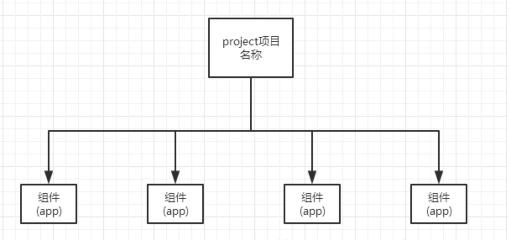

## <center>django框架的基础使用</center>

### 一、`django`项目大体架构组成



### 二、先介绍几个常用的命令

* 1、创建项目

  ```py
  django-admin startproject 项目名称
  ```

* 2、创建一个`App`

  ```py
  python manage.py startapp 组件名称
  ```

* 3、运行项目(默认端口是8000,如果你开发过程中使用酷狗音乐就会出现端口冲突,需要修正)

  ```py
  python manage.py runserver [端口号]
  ```

* 4、创建数据库映射文件

  ```py
  python manage.py makemigrations
  ```

* 5、将映射文件中的映射到数据库中

  ```py
  python manage.py migrate
  ```

### 三、关于`django`请求的过程

* 1、客户端浏览器中输入一个网址
* 2、进入`django`后台的总的`urls.py`中找到对应的`url`
* 3、找到`url`就对应到视图函数
* 4、视图函数中进行一系列的操作(操作数据库),返回给客户端