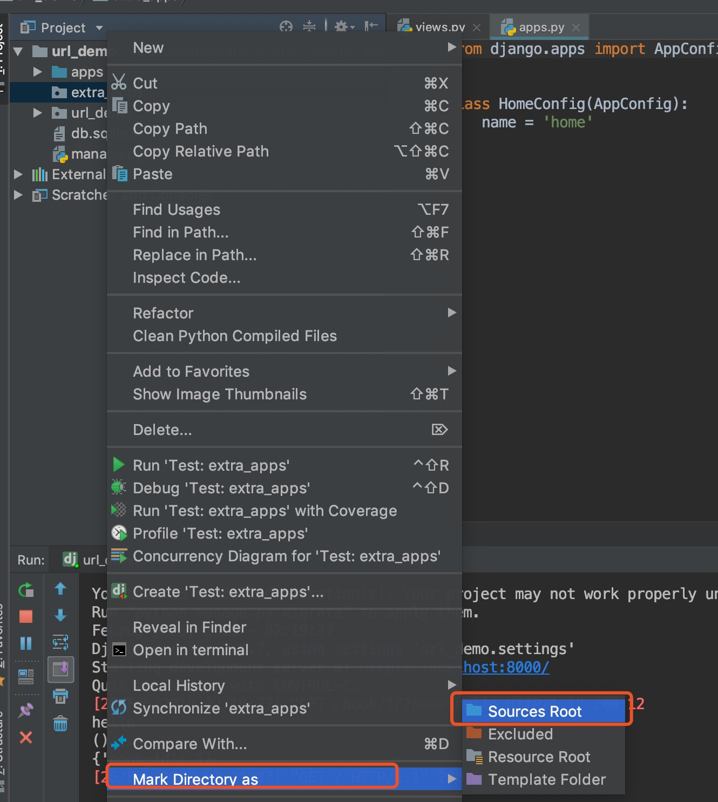

## <center>django的基础配置</center>

### 一、项目创建
* 1、使用`virtualenvwrapper`或`pipenv`创建一个`django`的虚拟环境,并安装依赖包
* 2、使用命令创建一个项目

	```shell
	django-admin startproject [项目名字]
	```

### 二、`django`中项目文件的配置
> 这步骤不使用也可以,看个人,本人喜欢将全部的`app`放在一个目录下,使用第三方的`app`放在一个目录下

* 1、项目中创建一个文件夹`apps`
* 2、项目中创建一个文件夹`extra_apps`
* 3、根据下图方式将上面两个创建的文件夹变成根目录

	
* 4、在项目的`settings.py`中添加配置信息

	```py
	import os
	import sys

	# Build paths inside the project like this: os.path.join(BASE_DIR, ...)
	BASE_DIR = os.path.dirname(os.path.dirname(os.path.abspath(__file__)))

	sys.path.insert(0, os.path.join(BASE_DIR, 'apps'))
	sys.path.insert(0, os.path.join(BASE_DIR, 'extra_apps'))
	```
* 5、使用命令创建`app`,并直接拖到`apps`文件夹下

	```shell
	python manage.py startapp [app名字]
	```
* 6、同理如果是`git`上下载的第三方源代码就放到`extra_apps`文件夹下

### 三、关于视图与`url`的关联
在`django`中有两种模式来写视图

* 使用函数的方式(`FBV`模式)
* 使用类的方式(`CBV`模式),本人更喜欢使用类的方式来创建视图


下面介绍使用`CBV`模式来实现视图

* 1、创建一个`book`的`app`并且在`settings.py`中注册
* 2、将`book`拖到`apps`文件夹下
* 3、在`book`的`app`目录下创建一个`urls.py`的文件,用于存放当前视图全部的`url`
* 4、在视图类中创建几个类

	```py
	from django.http import HttpResponse
	from django.views import View


	class BookView(View):
	    """
	    图书主页视图
	    """

	    def dispatch(self, request, *args, **kwargs):
	    	 # dispatch这个函数可以不写,查看django源码就是从这个函数开始的
	        result = super().dispatch(request, *args, **kwargs)
	        return result

	    def get(self, request, *args, **kwargs):
	        return HttpResponse('图书首页')

	    def post(self, request, *args, **kwargs):
	        pass


	class BookDetailView(View):
	    """
	    图书详情视图
	    """

	    def get(self, request, *args, **kwargs):
	        # http://localhost:8000/book/1/?name=hello
	        print(request.GET.get('name', None))
	        print(args)
	        # 可以获取到url上定义的参数
	        print(kwargs)
	        return HttpResponse('图书详情')

	    def post(self, request, *args, **kwargs):
	        pass
	```

* 5、在本`app`下的`urls.py`中定义`url`信息

	```py
	from django.urls import path
	from . import views

	app_name = 'book'

	urlpatterns = [
	    path('', views.BookView.as_view(), name='book_index'),
	    path('<int:book_id>/', views.BookDetailView.as_view(), name='book_detail')
	]
	```

* 6、在主路由中引入当前`app`的`urls.py`文件

	```py
	from django.urls import path, include

	urlpatterns = [
	    path('', include('home.urls', namespace='home')),
	    path('book/', include('book.urls', namespace='book'))
	]
	```

### 四、配置时区(后面会有专题介绍)
>在`settings.py`中配置(以上海时间为配置)大概在109行

```py
TIME_ZONE = 'Asia/Shanghai' # 上海时区
USE_TZ = True
```

### 五、配置中文显示(主要是`admin`中显示)
> 在`settings.py`中配置

```py
LANGUAGE_CODE = 'zh-hans' # 中文支持，django1.8以后支持；1.8以前是zh-cn
```

### 六、数据库的配置
* 1、默认数据库是使用`sqlite`
* 2、如果要使用`mysql`数据库

	```py
	DATABASES = {
	    'default': {
	        'ENGINE': 'django.db.backends.mysql', # 数据库引擎
	        'NAME': 'djangotest', #数据库名称
	        'USER': 'root', # 链接数据库的用户名
	        'PASSWORD': 'root', # 链接数据库的密码
	        'HOST': '127.0.0.1', # mysql服务器的域名和ip地址
	        'PORT': 3306, # mysql的一个端口号,默认是3306
	    }
	}
	```
* 3、<font color="#f00">如果你是使用`pymysql`连接工具必须要在站点`__init__.py`的文件配置</font>

	```py
	import pymysql
	pymysql.install_as_MySQLdb()
	```

* 4、使用`mongodb`数据库

	```py
	DATABASES = {
	    'default': {
	        'ENGINE': None,
	    }
	}
	from mongoengine import connect
	connect('数据库名')
	```

### 七、模板的配置
> 如果是使用命令方式创建的项目,不会自己创建`templates`的文件夹,需要手动创建

* 1、手动创建一个文件夹`templates`
* 2、在`settings.py`的`TEMPLATES`下面配置模板的使用路径

	```py
	'DIRS': [os.path.join(BASE_DIR,'templates' )]
	```
* 3、补充说明`'APP_DIRS': True,`的认识
	* 这句话的意思是说,如果在`templates`文件夹下没找到模板会在已经安装的`app`下继续查找模板,如果没有找到就报错,有就渲染到页面

### 八、静态文件的配置
> 在开发过程中可能会使用到的`css`文件、`js`文件、`img`文件我们统一归到静态文件中

* 1、加载静态的也是一个`app`,查看`app`中是否加载该组件

	```py
	INSTALLED_APPS = [
	    ...
	    'django.contrib.staticfiles',
	]
	```
* 2、说明(静态文件夹的命名是根据`settings.py`中`STATIC_URL`一样就可以)

	```py
	STATIC_URL = '/static/'
	```
* 3、在`settings.py`中配置静态文件地址

	```py
	STATICFILES_DIRS = (
	    'static',
	)
	```
* 4、将`static`变成`django`内置标签(这样就不需要在每个`html`页面头部` load staticfiles `)

	```py
	# 在settings.py文件中配置
	TEMPLATES = [
	    {
	        ...
	        'OPTIONS': {
	            'context_processors': [
	                ...
	            ],
	            'builtins': ['django.templatetags.static']
	        },
	    },
	]
	```
