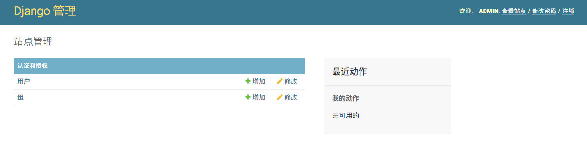

##<center>admin的基本配置</center>

### 一、创建登陆用户
* 1、使用命令生产数据库文件

  ```py
  python manage.py makemigrations
  python manage.py migrate 
  ```

* 2、使用命令创建`admin`的登陆用户名及密码

  ```py
  (django_demo-7bodv_Pa) ➜  admin_demo01 python manage.py createsuperuser
  Username (leave blank to use 'shuiping.kuang'): admin       
  Email address: 332904234@qq.com
  Password: 
  Password (again):
  Superuser created successfully.
  (django_demo-7bodv_Pa) ➜  admin_demo01 
  ```

* 3、使用密码及用户名登陆

### 二、配置中文页面
  > `django-admin`登陆进入主页后全是英文,对于我这样英语不好,又是国内项目,肯定要使用中文

* 1、配置中文显示(在`settings.py`文件中配置)

  ```py
  # LANGUAGE_CODE = 'en-us'
  LANGUAGE_CODE = 'zh-hans'
  ```

* 2、顺带配置下时区(只是显示时间跟你本地时间匹配)

  ```py
  TIME_ZONE = 'Asia/Shanghai' # 设置上海的时区
  USE_TZ = False  # 设置存入数据库的时间格式
  ```

* 3、登陆进来界面

  
