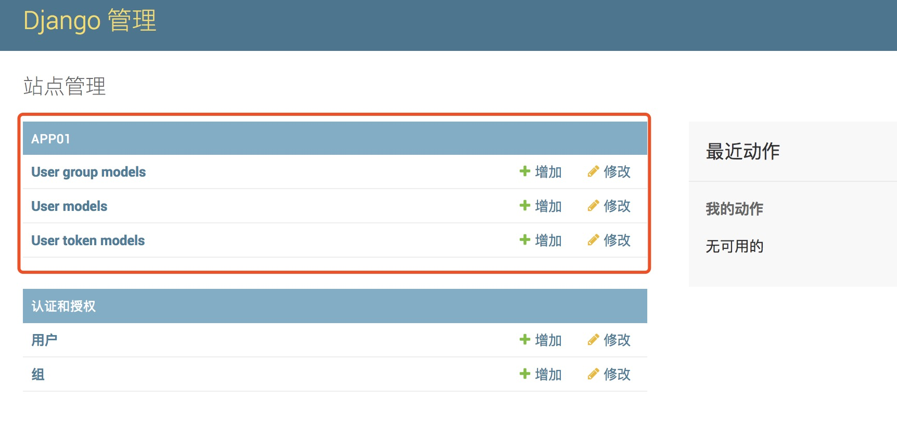
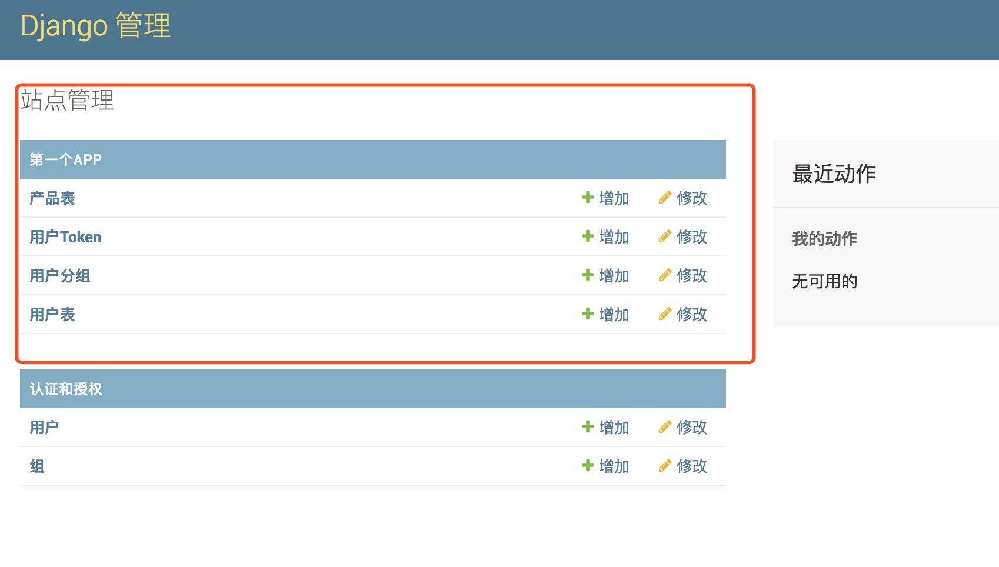

##<center>admin的基本使用</center>

### 一、注册现有的`model`
* 1、在`app`下面的`admin.py`文件中(创建`app`的时候会默认创建)
* 2、注册`model`

  ```py
  from django.contrib import admin

  # Register your models here.

  from .models import *

  admin.site.register(UserModel)

  admin.site.register(UserTokenModel)

  admin.site.register(UserGroupModel)
  ```

* 3、页面显示效果

  

* 4、修改显示表名(需要在`model`中添加`meta`消息)

  ```py
  class GoodsModel(models.Model):
      """
      创建一个产品表
      """
      name = models.CharField(max_length=100, null=False, verbose_name='产品名称')
      price = models.FloatField(verbose_name='产品价格')
      create_at = models.DateTimeField(auto_now_add=True, null=True)

      class Meta(object):
          verbose_name = '产品表'
          verbose_name_plural = verbose_name
  ```

* 5、修改上面的`app01`的名字(在`app`下面的`__init__.py`文件中添加内容)

  ```py
  from os import path
  from django.apps import AppConfig

  VERBOSE_APP_NAME = "第一个app" # 你要修改的名字

  def get_current_app_name(file):
      return path.dirname(file).replace('\\', '/').split('/')[-1]

  class AppVerboseNameConfig(AppConfig):
      name = get_current_app_name(__file__)
      verbose_name = VERBOSE_APP_NAME

  default_app_config = get_current_app_name(__file__) + '.__init__.AppVerboseNameConfig'
  ```

* 6、效果图

  

* 7、也可以使用下面方式修改`App`显示的名字

  * 1.在`apps.py`中配置
  
    ```py
    from django.apps import AppConfig

    class UsersConfig(AppConfig):
        name = 'users'
        verbose_name = '用户'
    ```
  
  * 2.在`App`的`__init__.py`文件中

    ```py
                         # 组件名.apps.apps.py中的类名
    default_app_config = "users.apps.UsersConfig"
    ```

### 二、显示最基本的字段

* 1、在`model`中设置(产品的`model`中添加)

  ```py
  ...
  def __str__(self):
      return self.name
  ...
  ```

### 三、`admin`的基本配置

* 1、使用`list_display`显示字段

  ```py
  class GoogModelConfig(admin.ModelAdmin):
      list_display = ['name', 'price', 'create_at']

  admin.site.register(GoodsModel, GoogModelConfig)
  # 也可以使用装饰器的方式
  @admin.register(GoodsModel)
  class GoogModelConfig(admin.ModelAdmin):
      list_display = ['name', 'price', 'create_at']
  ```

* 2、使用`list_display_links`配置列表点击可以点击到编辑页面

  ```py
  @admin.register(GoodsModel)
  class GoogModelConfig(admin.ModelAdmin):
      list_display = ['name', 'price', 'create_at']
      list_display_links = ['name', 'price']
  ```

* 3、自定义函数显示列

  ```py
  from django.utils.safestring import mark_safe

  @admin.register(GoodsModel)
  class GoogModelConfig(admin.ModelAdmin):
      def deletes(self):
          return mark_safe("<a href=''>删除</a>")

      list_display = ['name', 'price', 'create_at', deletes]
      list_display_links = ['name', 'price']
  ```

* 4、`list_filter`,列表时,定制右侧快速筛选
* 5、`list_editable`,列表时,设置可以编辑
* 6、`search_fields`新增搜索框
* 7、`date_hierarchy`可以配置一个时间过滤的

  ```py
  ...
  date_hierarchy = 'create_at'
  ...
  ```

* 8、关于更多字段的显示[请参考](http://www.cnblogs.com/yuanchenqi/articles/8323452.html)

