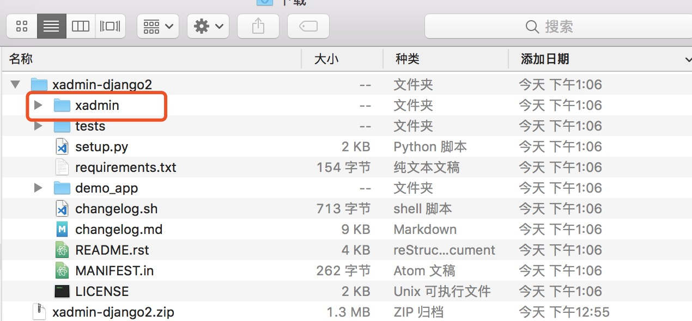

##<center>xadmin的介绍及安装</center>

### 一、关于`xadmin`的介绍

* 1、[官网地址](http://sshwsfc.github.io/xadmin/)
* 2、官网首页介绍它的基本特性
  * 1.基于`bootstrap3`
  * 2.内置功能丰富
  * 3.真心强大的插件系统


### 二、安装包

* 1、方法一(基于包的安装方式)

  ```py
  # 注意要选择django2的
  pipenv install git+git://github.com/sshwsfc/xadmin.git@django2
  ```

* 2、方式二(直接`github`上下载源码(选择分支下载`master`分支是`django<2`的),解压把下面圈住的放到项目工程下)

  

  * 1.需要安装的包
  
    ```py
    pipenv install future
    pipenv install django_import_export
    pipenv install django-crispy-forms
    pipenv install django-formtools
    pipenv install six
    pipenv install httplib2
    ```

* 3、使用方法二配置的方式建议根据第一章第十二小节的方式配置根目录

### 三、关于xadmin的配置

* 1、注册`app`

  ```py
  INSTALLED_APPS = [
      ...
      'xadmin',
      'crispy_forms'
  ]
  ```

* 2、修改主的`urls.py`

  ```py
  from django.urls import path
  import xadmin

  urlpatterns = [
      path('xadmin/', xadmin.site.urls),
  ]
  ```

* 3、生成表

  ```py
  python manage.py makemigrations
  python manage.py migrate
  ```

  ```sql
  | django_content_type        |
  | django_migrations          |
  | django_session             |
  | xadmin_bookmark            |
  | xadmin_log                 |
  | xadmin_usersettings        |
  | xadmin_userwidget          |
  +----------------------------+
  20 rows in set (0.00 sec)
  ```

* 4、运行项目

* 5、创建用户

  ```py
  python manage.py createsuperuser
  ```