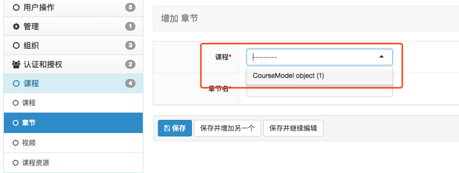
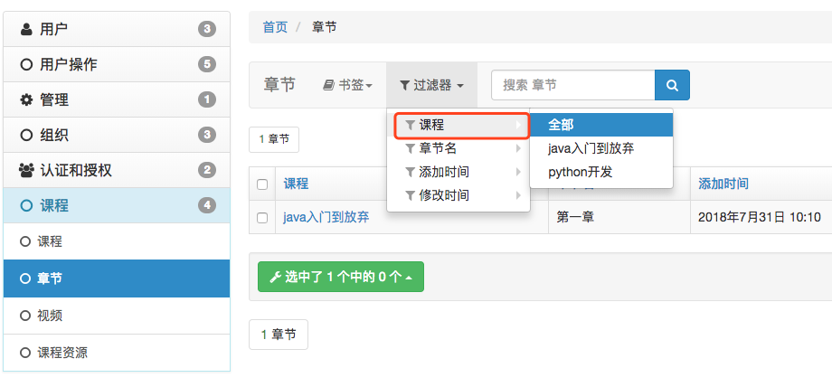

##<center>xadmin注册表及基本配置</center>

### 一、把数据模型在`xadmin`中显示

* 1、在`app`下创建一个`adminx.py`的文件
* 2、类似前面介绍的`admin.py`的一样的注册

  ```py
  import xadmin

  from .models import *

  class GoogModelConfig(object):
      list_display = [需要显示的字段]
      search_fields = [需要搜索的字段,建议不要放时间字段]
      list_filter = [过滤查找的字段]

  xadmin.site.register(GoodsModel, GoogModelConfig)
  # 这个地方没装饰器的使用方式
  ```

* 3、关于显示表名及`app`名与`admin.py`一样的使用

### 二、全局配置

* 1、配置主题(随便在一个`adminx.py`中)

  ```py
  from xadmin import views
  from .models import *

  class BaseSetting(object):
      enable_themes = True 
      use_bootswatch = True

  xadmin.site.register(views.BaseAdminView, BaseSetting)
  ```

* 2、左上角`logo`文字及底部文字配置

  ```py
  class GlobalSetting(object):
      site_title = '后台管理系统'
      site_footer = '我是底部'

  xadmin.site.register(views.CommAdminView, GlobalSetting)
  ```

* 3、左侧菜单收起

  ```py
  class GlobalSetting(object):
      site_title = '后台管理系统'
      site_footer = '我是底部'
      menu_style = 'accordion'  # 设置菜单可以收起

  xadmin.site.register(views.CommAdminView, GlobalSetting)
  ```

### 三、其它配置

* 1、不显示是一个对象

  

* 2、在`models.py`中重载`__str__`方法

  ```py
  ....
  def __str__(self):
      return self.name
  ```

* 3、外键过滤

  

* 4、遇到外键的问题需要使用双下划线

  ```py
  class LessonModelConfig(object):
      list_display = ['course', 'name', 'create_at', 'update_at']
      search_fields = ['course', 'name']
      # 使用双下滑线就可以关联到课程表的name
      list_filter = ['course__name', 'name', 'create_at', 'update_at']
  ```
