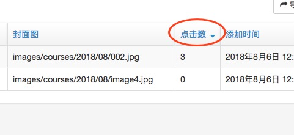
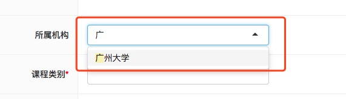
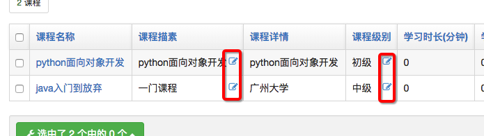
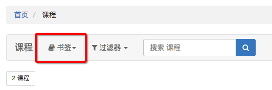
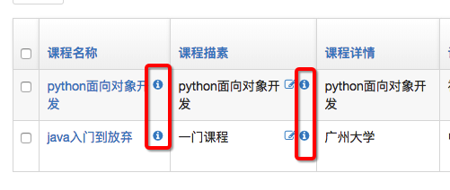

##<center>关于xadmin设置的补充</center>


### 一、图标的设置

* 1、直接在注册的配置文件中设置图标

  ```py
  class EmailVerifyRecordModelConfig(object):
      list_display = ['code', 'email', 'sent_type', 'create_at']
      search_fields = ['code', 'email', 'sent_type']
      list_filter = ['code', 'email', 'sent_type', 'create_at']
      # 设置图标
      model_icon = 'fa fa-user'
  ```

* 2、查找自己喜欢的图标[font Awesome官网](http://fontawesome.dashgame.com/)

* 3、官网上复制的图标可能不生效,就要手动的替换字体的`css`文件

### 二、排序功能

* 1、在注册的配置文件中设置

  ```py
  class CourseModelConfig(object):
      list_display = ['name', 'desc', 'detail', 'degree', 'learn_times', 'students', 'fav_num', 'image', 'click_nums',
                      'create_at', 'update_at']
      search_fields = ['name', 'desc', 'detail', 'degree', 'learn_times', 'students', 'fav_num', 'image', 'click_nums']
      list_filter = ['name', 'desc', 'detail', 'degree', 'learn_times', 'students', 'fav_num', 'image', 'click_nums',
                     'create_at', 'update_at']
      # 配置排序的字段
      ordering = ['-click_nums']
  ```

* 2、在页面中显示

  

### 三、只读字段(一些字段不能编辑,比如用户访问量及收藏量)

* 1、在注册的配置文件中设置

  ```py
  class CourseModelConfig(object):
      ...
      readonly_fields = ['click_nums', 'fav_num']
  ```

### 四、配置编辑的时候不显示字段(注意与上面会相冲突)

* 1、在注册的配置文件中设置

  ```py
  class CourseModelConfig(object):
      ...
      exclude = ['click_nums', 'fav_num']
  ```

### 五、配置下拉框可搜索

* 1、如果下拉框的内容比较多的时候,要去选择会比较麻烦,需要配置类似`ajax`的来加载

* 2、在注册的配置文件中设置

  ```py
  class CourseModelConfig(object):
      ...
      relfield_style = 'fk-ajax'
  ```

* 3、展示视图

  

### 六、设置行内可编辑

* 1、代码实现

  ```py
  class CourseModelConfig(object):
      ...
      list_editable = ['desc', 'degree']
      relfield_style = 'fk-ajax'
  ```

* 2、效果展示

  

### 七、自定义字段

* 1、有些在`models`中没有定义的字段
* 2、在`adminx.py`配置类中定义函数

  ```py
  ...
  def get_zj_nums(self, *args, **kwargs):
      return self.lessonmodel_set().all().count()
  # 在前端显示字段的名字
  get_zj_nums.short_description = '章节数'
  ```

* 3、设置

  ```py
  class CourseModelConfig(object):
      list_display = ['name', 'get_zj_nums']
      relfield_style = 'fk-ajax'
      show_bookmarks = False

      def get_zj_nums(self, *args, **kwargs):
          return self.lessonmodel_set().all().count()

      get_zj_nums.short_description = '章节数'
  ```

### 八、取消书签

* 1、效果

  

* 2、在配置类中新增

  ```py
  class CourseModelConfig(object):
      ...
      show_bookmarks = False
  ```

### 九、刷新

* 1、在配置类中

  ```py
  class CourseModelConfig(object):
      ...
      refresh_times = (3, 5)
  ```

### 十、显示详情

* 1、在配置类中

  ```py
  class CourseModelConfig(object):
      ...
      show_detail_fields = ['name', 'desc']
  ```

* 2、效果图

  

### 十一、显示跳转

* 1、在配置类

  ```py
  def go_to(self, *args, **kwargs):
      from django.utils.safestring import mark_safe

      return mark_safe("<a href='https://www.baidu.com'>跳转</a>")

  go_to.short_description = '链接'
  ```
