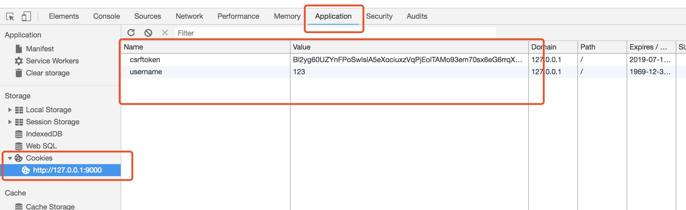
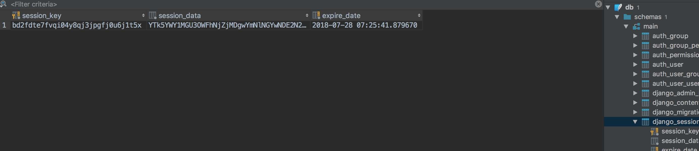

##<center>关于cookie和session的认识</center>

### 一、关于`cookie`的产生的原因
* 1、由于`HTTP`协议是无状态的协议，所以服务端需要记录用户的状态时，就需要用某种机制来识具体的用户
* 2、但是服务端如何识别特定的客户？这个时候`Cookie`就登场了。每次`HTTP`请求的时候，客户端都会发送相应的`Cookie`信息到服务端。实际上大多数的应用都是用`Cookie`来实现`Session`跟踪的，第一次创建`Session`的时候，服务端会在`HTTP`协议中告诉客户端，需要在 `Cookie` 里面记录一个`Session ID`，以后每次请求把这个会话ID发送到服务器，我就知道你是谁了。有人问，如果客户端的浏览器禁用了 `Cookie` 怎么办？一般这种情况下，会使用一种叫做URL重写的技术来进行会话跟踪，即每次`HTTP`交互，`URL`后面都会被附加上一个诸如` sid=xxxxx` 这样的参数(或者在请求头里面加上一个`token`是比较常见的,就是用来标识用户)，服务端据此来识别用户。
* 3、`Cookie`其实还可以用在一些方便用户的场景下，设想你某次登陆过一个网站，下次登录的时候不想再次输入账号了，怎么办？这个信息可以写到`Cookie`里面，访问网站的时候，网站页面的脚本可以读取这个信息，就自动帮你把用户名给填了，能够方便一下用户。

### 二、在`django`中获取`cookie`

* 1、直接使用`request.COOKIES`来获取`cookies`,获取到的`cookies`是一个字典,可以直接取值出来

  ```py
  from django.shortcuts import render, HttpResponse
  from django.views import View

  class LoginView(View):
      def get(self, request):
          print(request.COOKIES)
          return render(request, 'test1.html')

      def post(self, request):
          print('request====', request.POST)
          print(request.COOKIES)
          return HttpResponse('成功')
  ```

* 2、服务器端设置`cookie`(使用`ret.set_cookie(key, val)`)

  ```py
  class LoginView(View):
      def get(self, request):
          print(request.COOKIES)
          return render(request, 'test1.html')

      def post(self, request):
          print('request====', request.POST)
          print(request.COOKIES)
          username = request.POST.get('username', None)
          passwd = request.POST.get('passwd', None)
          if username == '123' and passwd == 'admin123':
              # 登录成功设置cookie
              ret = redirect('/test1/index')
              ret.set_cookie('username', username)
              return ret
          return HttpResponse('登录失败')

  class IndexView(View):
      def get(self, request):
          print('获取的cookie', request.COOKIES)
          return render(request, 'index.html')
  ```

* 3、`cookie`设置时间(不指定是2周)

  ```py
  ...
  # 这里的时间是按天来计算的
  ret.set_cookie('username', username, max_age=1)
  ...
  ```

### 二、关于`cookie`的缺陷
* 1、前面说到的`http`是无状态的,我们一般会用`cookie`来标识用户
* 2、既然是这样,`cookie`中肯定有用户信息,被人劫持了就可以获取用户一些基本信息
* 3、由于`cookie`直接在浏览器上可以查看到,很容易被人劫持



### 三、关于`session`和`cookie`配合使用

由于前面说到的`cookie`会被人劫持获取到用户信息,因此才产生了`session`(注意不是前端本地存储的`window.sessionStorage`)


`session`存在服务器端,`cookie`存在客户端,现在服务器端给浏览器的就是一个`key`(通俗点就是一个钥匙),用户请求的时候都要携带这个`key`(钥匙),服务器端拿到客户端的这个`key`然后进行校验(俗称开锁),如果匹配成功就表示当前用户是有效的,否则是无效的.

### 四、`session`的使用

* 1、`django`中关于`session`是存放在中间件中

  ```py
  MIDDLEWARE = [
      'django.middleware.security.SecurityMiddleware',
      'django.contrib.sessions.middleware.SessionMiddleware', # session的中间件
      'django.middleware.common.CommonMiddleware',
      'django.middleware.csrf.CsrfViewMiddleware',
      'django.contrib.auth.middleware.AuthenticationMiddleware',
      'django.contrib.messages.middleware.MessageMiddleware',
      'django.middleware.clickjacking.XFrameOptionsMiddleware',
  ]
  ```

* 2、获取`session`的方法(`request.session`)

  ```py
  # 获取到的session是一个对象
  获取session <django.contrib.sessions.backends.db.SessionStore object at 0x109e7ecf8>
  ```

* 3、由于`session`是存在数据库中要先生成表

  ```py
  python manage.py makemigrations
  python manage.py migrate
  ```

* 3、设置`session`

  ```py
  class LoginView(View):
      def get(self, request):
          print(request.COOKIES)
          return render(request, 'test1.html')

      def post(self, request):
          username = request.POST.get('username', None)
          passwd = request.POST.get('passwd', None)
          if username == '123' and passwd == 'admin123':
              # 登录成功设置session
              request.session['username'] = username
              request.session['is_login'] = True
              return redirect('/test1/index')
          return HttpResponse('登录失败')
  ```

* 4、获取`session`

  ```py
  class IndexView(View):
      def get(self, request):
          print('获取session', request.session.get('is_login'))
          print('获取session', request.session.get('username'))
          return render(request, 'index.html')
  ```

* 5、查看数据库中存储的`session`
  * 1.我们自己都不知道存的是什么东西
  * 2.没有设置过期时间默认是2week(14day)

  

* 6、`session`设置时间

  ```py
  request.session.set_expiry(valule)
  ```
  * 1.如果`vaule`是一个整数表示,`session`在这毫秒后就会失效
  * 2.如果`vaule`是一个`datatime`或者`timedelta`表示,`session`在这个时间点后就会失效
  * 3.如果`vaule`是一个0表示,`session`在浏览器关闭好就会失效
  * 4.如果`vaule`是一个None表示,`session`会依赖全局的`session`策略
