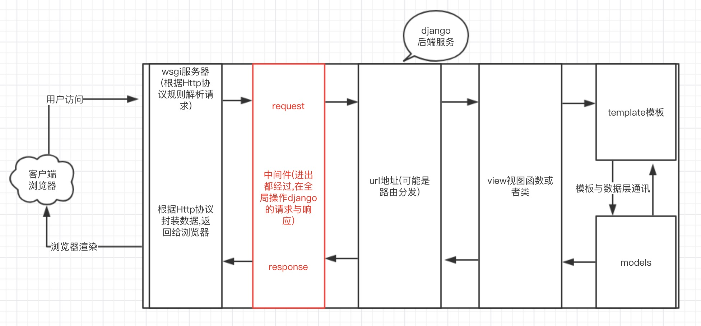

##<center>中间件的认识</center>

### 一、`django`的请求过程

* 1、图解

  


### 二、关于中间件的理解

* 1、关于中间件的认识[官网](https://docs.djangoproject.com/en/1.8/topics/http/middleware/)
* 2、从官网的介绍中间件是:**中间件是Django请求/响应处理的钩子框架。它是一个轻巧的低级"插件"系统，用于全局改变`Django`的输入或输出。**这里说的输入是指`request`,输出是指`response`。

### 三、`django`中中间件的介绍

* 1、只有放在`settings.py`中`MIDDLEWARE_CLASSES`里面的中间件才算是激活了,才有效果
* 2、创建项目自带的中间件

  ```py
  MIDDLEWARE_CLASSES = (
      'django.middleware.security.SecurityMiddleware',
      'django.contrib.sessions.middleware.SessionMiddleware',
      'django.middleware.common.CommonMiddleware',
      'django.middleware.csrf.CsrfViewMiddleware',
      'django.contrib.auth.middleware.AuthenticationMiddleware',
      'django.contrib.auth.middleware.SessionAuthenticationMiddleware',
      'django.contrib.messages.middleware.MessageMiddleware',
      'django.middleware.clickjacking.XFrameOptionsMiddleware',
  )
  ```

* 3、中间件排序是有要求的,执行顺序是从上到下的[参考文档](https://docs.djangoproject.com/en/1.8/ref/middleware/#middleware-ordering)

### 四、温习`python`的反射导包机制

* 1、`demo`的目录结构

  ```py
  test
    foo
      __init__.py
      foo.py
    __init__.py
    test.py
  ```

* 2、`foo.py`的代码

  ```py
  name = '张三'

  def foo():
      return 'foo函数'
  ```

* 3、`test.py`的代码

  ```py
  import importlib
  # 利用反射查找到文件,实现导包
  foo = importlib.import_module('foo.foo')

  print(foo.name)
  # 函数的调用
  print(foo.foo())
  ```

* 4、`django`的中间件就是利用反射的机制实现导包的,手动导包如下:

  ```py
  from django.middleware.clickjacking import XFrameOptionsMiddleware
  ```

### 五、自定义中间件

* 1、中间件要继承一个类`MiddlewareMixin`

  ```py
  from django.utils.deprecation import MiddlewareMixin
  ```

* 2、中间件要实现的方法有:主要是`process_request`和`process_response`
  * `process_request(self,request)`
  * `process_view(self, request, view_func, view_args, view_kwargs)`
  * `process_template_response(self,request,response)`
  * `process_exception(self, request, exception)`
  * `process_response(self, request, response)`

* 3、自定义中间件的示例

  ```py
  from django.utils.deprecation import MiddlewareMixin

  class Md1(MiddlewareMixin):

      def process_request(self, request):
          print('md1的request方法')

      def process_response(self, request, response):
          print('md1的response方法')
          return response
  ```
* 4、在`settings.py`中配置

  ```py
  MIDDLEWARE = [
      ...
      'middle.md1.Md1',
  ]
  ```

### 六、关于中间件中几个函数的认识

* 1、`process_request(self,request)`<font color="#f00;">客户端请求进入`django`服务器的过程</font>
  * 1.参数`request`和视图函数或者视图类中的`request`一样的,可以获得到`session`的参数的
  * 2.当返回值为`None`(不写返回值`python`中默认返回`None`)的时候会按照顺序执行下一个中间件中的`process_request`函数,以此类推
  * 3.当返回`HttpResponse`对象的时候,就不继续执行到视图类中,直接返回`HttpResponse`来渲染页面
  * 4.中间件的`process_request`方法是在执行视图函数之前执行的
  * 5.当配置多个中间件时，会按照`MIDDLEWARE`中的注册顺序，也就是列表的索引值，从前到后依次执行的
  * 6.不同中间件之间传递的`request`都是同一个对象

* 2、`process_response(self, request, response)`<font color="#f00;">响应返回给客户端</font>
  * 1.`request`参数和上面`process_request`中的一样
  * 2.`response`是视图函数返回的`HttpResponse`对象。<font color="#f00">**该方法的返回值也必须是`HttpResponse`对象**</font>
  * 3.如果自己定义返回`HttpResponse`对象的时候就会取代视图中返回的`response`
  * 4.`process_response`函数是在视图函数或者视图类之后执行的
  * 5.如果多个中间件的时候执行顺序也是根据先注册的先执行

* 3、`process_view(self, request, view_func, view_args, view_kwargs)`
  * 1.<font color="#f00">`Django`会在调用视图函数之前调用`process_view`方法,但是是在`process_request`之后调用</font>
  * 2.`request`参数和上面介绍的一样
  * 3.`view_func`是`Django`即将使用的视图函数（它是实际的函数对象，而不是函数的名称作为字符串）
  * 4.`view_args`是将传递给视图的位置参数的列表
  * 5.`view_kwargs`是将传递给视图的关键字参数的字典。
  * 6.`view_args`和`view_kwargs`都不包含第一个视图参数（`request`）
  * 7.如果返回`None`,`Django`将继续处理这个请求，执行任何其他中间件的`process_view`方法，然后在执行相应的视图
  * 8.如果返回一个`HttpResponse`对象,`Django`不会调用适当的视图函数。它将执行中间件的`process_response`方法并将应用到该`HttpResponse`并返回结果。

* 4、`process_exception(self, request, exception)`当视图函数或者类发生异常的时候才会触发
  * 1.`request`是`HttpRequest`对象
  * 2.`exception`是视图函数异常产生的`Exception`对象
  * 3.**触发条件**<font color="#f00">这个方法只有在视图类中发生异常的时候才会触发执行</font>
  * 4.如果返回`None`,则交给下一个中间件的`process_exception`方法来处理异常
  * 5.如果返回`HttpResponse`对象,`Django`将调用模板和中间件中的`process_response`方法，并返回给浏览器，否则将默认处理异常
  * 6.如果视图函数中无异常,`process_exception`方法不执行

* 5、`process_template_response(self, request, response)`
  * 1.`request`是一个HttpRequest对象
  * 2.`response`是`TemplateResponse`对象（由视图函数或者中间件产生）
  * 3.`process_template_response`是在视图函数执行完成后立即执行，但是它有一个前提条件，那就是视图函数返回的对象有一个`render()`方法（或者表明该对象是一个`TemplateResponse`对象或等价方法）


### 七、使用中间件做登陆拦截的案例

* 1、视图类

  ```py
  from django.shortcuts import render, redirect

  # Create your views here.

  from django.views import View

  from .models import UserModel

  class LoginView(View):
      """
      用户登陆视图类
      """

      def get(self, request, *args, **kwargs):
          return render(request, 'login.html')

      def post(self, request, *args, **kwargs):
          username = request.POST.get('username', None)
          password = request.POST.get('password', None)
          if username and password:
              user = UserModel.objects.filter(username=username, password=password).first()
              if user:
                  request.session['user'] = user
                  # 获取登陆前的url
                  next_url = request.GET.get('next', None)
                  if next_url:
                      return redirect(next_url)
                  else:
                      return redirect('index')
              else:
                  return redirect('/login/')
          else:
              return redirect('/login/')

  class IndexView(View):
      """
      主页
      """

      def get(self, request, *args, **kwargs):
          return render(request, 'index.html', locals())
  ```

* 2、中间件

  ```py
  from django.utils.deprecation import MiddlewareMixin
  from django.shortcuts import redirect

  class AuthMD(MiddlewareMixin):
      def process_request(self, request):
          user = request.session.get('user')
          if user:
              pass
          else:
              return redirect('/login/')
  ```
