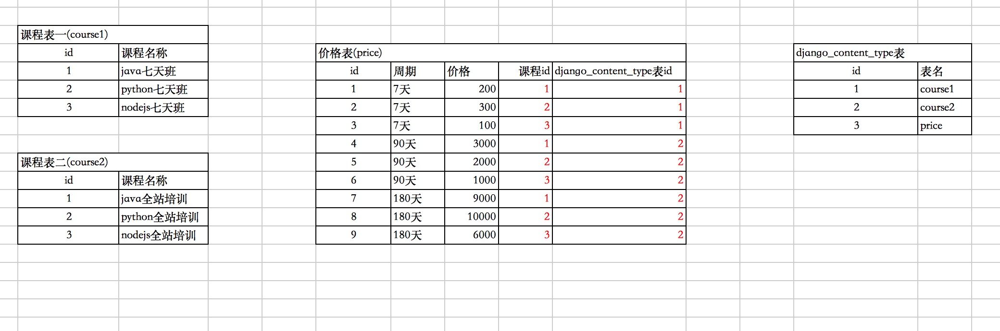

## <center>关于 contenttypes 的使用</center>

### 一、`django`中自带的`app`的介绍

* 1、`INSTALLED_APPS`中已注册的`app`

  ```py
  INSTALLED_APPS = [
      'django.contrib.admin', # 后台管理系统
      'django.contrib.auth', # 权限
      'django.contrib.contenttypes', # 本章节介绍的
      'django.contrib.sessions', # session模块
      'django.contrib.messages',
      'django.contrib.staticfiles' # 处理静态文件的
  ]
  ```

* 2、关于`contenttypes`生成的表(**其实就是一张存储`app`名称及`app`下面的拥有表名的总表**)

  ```sql
  mysql> desc django_content_type;
  +-----------+--------------+------+-----+---------+----------------+
  | Field     | Type         | Null | Key | Default | Extra          |
  +-----------+--------------+------+-----+---------+----------------+
  | id        | int(11)      | NO   | PRI | NULL    | auto_increment |
  | app_label | varchar(100) | NO   | MUL | NULL    |                |
  | model     | varchar(100) | NO   |     | NULL    |                |
  +-----------+--------------+------+-----+---------+----------------+
  3 rows in set (0.00 sec)

  mysql>
  ```

* 3、最原始的数据(如果自己注册的`App`中有`model`就会在这个表中插入数据)

  ```sql
  mysql> select * from django_content_type;
  +----+--------------+-------------+
  | id | app_label    | model       |
  +----+--------------+-------------+
  |  1 | admin        | logentry    |
  |  3 | auth         | group       |
  |  2 | auth         | permission  |
  |  4 | auth         | user        |
  |  5 | contenttypes | contenttype |
  |  6 | sessions     | session     |
  +----+--------------+-------------+
  6 rows in set (0.00 sec)

  mysql> 
  ```


### 二、关于`django_content_type`使用场景

> ** <font color="#f00">一张表需要与多张表创建外键关联的时候</font>**

* 1、使用场景举例
  * 1.课程一对应的价格及上课周期
  * 2.课程二对应的价格及上课周期
  * 3.<font color="#f00">上面原本可以创建4张表,课程与价格是外键关联起来(两张价格表有点多余)</font>
  * 4.现在做的两个课程表对应一张价格表

* 2、使用`django_content_type`创建上面需求的图表分析

  

### 三、`django`代码实现

* 1、创建`model`

  ```py
  from django.db import models
  from django.contrib.contenttypes.models import ContentType
  from django.contrib.contenttypes.fields import GenericForeignKey, GenericRelation

  class CourseModel1(models.Model):
      """
      课程表一
      """
      name = models.CharField(max_length=30, null=False, blank=False, verbose_name='课程名称')

      class Meta(object):
          verbose_name = '课表表一'
          verbose_name_plural = verbose_name

      def __str__(self):
          return self.name

  class CourseModel2(models.Model):
      """
      课程表二
      """
      name = models.CharField(max_length=20, null=False, blank=False, verbose_name='课程名称')

      class Meta(object):
          verbose_name = '课程二'
          verbose_name_plural = verbose_name

      def __str__(self):
          return self.name

  class PriceModel(models.Model):
      """
      课程价格表
      """
      time_choices = (
          ('7d', '7天'),
          ('90d', '90天'),
          ('180d', '180天')
      )
      time = models.CharField(max_length=20, choices=time_choices, default='7d', verbose_name='学习周期')
      price = models.FloatField(default=0, verbose_name='课程价格')
      # PositiveIntegerField表示正整数的意思
      object_id = models.PositiveIntegerField(verbose_name='课程表id')
      content_type = models.ForeignKey(ContentType, on_delete=models.CASCADE, verbose_name='课程')
  ```

* 2、生成表

  ```py
  python manage.py makemigration
  python manage.py migrate
  ```

* 3、创建数据(课程表就不演示)

  ```py
  from django.shortcuts import HttpResponse
  from .models import PriceModel
  from django.contrib.contenttypes.models import ContentType

  def test(request):
      # 创建价格表数据
      PriceModel.objects.create(
          time='7d',
          price=200,
          object_id=1,
          # 创建外键
          content_type=ContentType.objects.get(model='coursemodel1')
      )
      return HttpResponse('hello')
  ```

* 4、查询数据

  ```py
  def test(request):
      price = PriceModel.objects.get(id=2)
      print(price.content_type)
      return HttpResponse('hello')
  ```

### 四、补充说明一(`GenericForeignKey`的使用)

* 1、使用`GenericForeignKey`方便添加数据与查询数据

  ```py
  from django.db import models
  from django.contrib.contenttypes.models import ContentType
  from django.contrib.contenttypes.fields import GenericForeignKey, GenericRelation

  class PriceModel(models.Model):
      """
      课程价格表
      """
      time_choices = (
          ('7d', '7天'),
          ('90d', '90天'),
          ('180d', '180天')
      )
      time = models.CharField(max_length=20, choices=time_choices, default='7d', verbose_name='学习周期')
      price = models.FloatField(default=0, verbose_name='课程价格')
      # PositiveIntegerField表示正整数的意思
      object_id = models.PositiveIntegerField(verbose_name='课程表id')
      content_type = models.ForeignKey(ContentType, on_delete=models.CASCADE, verbose_name='课程')
      # 不会在数据库中生成列，只是帮助你进行添加与查询的使用
      content_object = GenericForeignKey('content_type', 'object_id')
  ```

* 2、添加数据

  ```py
  from .models import PriceModel, CourseModel2

  def test(request):
      PriceModel.objects.create(
          time='90d',
          price=1000,
          object_id=3,
          # 直接使用表对象插入
          content_object=CourseModel2.objects.get(id=3)
      )
      return HttpResponse('hello')
  ```

* 3、查询数据

  ```py
  def test(request):
      price = PriceModel.objects.get(id=3)
      print(price.content_object.name)
      return HttpResponse('hello')
  ```

### 五、补充说明二(`GenericRelation`反向查找[根据课程查找价格列表])

* 1、修改课程表的`model`

  ```py
  class CourseModel2(models.Model):
      """
      课程表二
      """
      name = models.CharField(max_length=20, null=False, blank=False, verbose_name='课程名称')
      price_list = GenericRelation('PriceModel', verbose_name='价格列表')

      class Meta(object):
          verbose_name = '课程二'
          verbose_name_plural = verbose_name

      def __str__(self):
          return self.name
  ```

* 2、通过课程表的`id`查找到相对应的金额

  ```py
  def test(request):
      obj = CourseModel2.objects.get(id=2)
      for item in obj.price_list.all():
          print(item.time, item.content_object.name, item.price)
      return HttpResponse('hello')
  ```