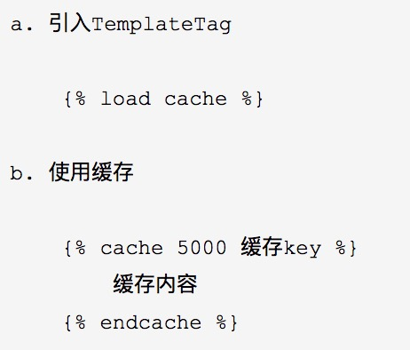

### <center>redis缓存的使用</center>

关于`redis`的基本使用可以[参考](https://kuangshp1.gitbooks.io/python-base/content/chapter12/0.html)

### 一、`django`中使用`redis`的缓存(原始方式)

* 1、创建一个`redis`的连接池

  ```py
  import redis

  POOL = redis.ConnectionPool(host="120.24.156.230", port=6379, password="123456", max_connections=1000)
  ```

* 2、在`django`中的视图函数/类中使用`redis`缓存

  ```py
  import redis
  from django.shortcuts import render
  from utils.redis_pool import POOL

  def index(request):
    conn = redis.Redis(connection_pool=POOL)
    conn.hset('aa', 'name', '张三')
    return render(request, 'index.html')
  ```

### 二、`django`中使用`redis`的缓存(使用第三方包)

* 1、安装包

  ```py
  pip3 install django-redis
  ```

* 2、在`settings.py`中配置缓存

  ```py
  CACHES = {
      "default": {
          "BACKEND": "django_redis.cache.RedisCache",
          "LOCATION": "redis://127.0.0.1:6379",
          "OPTIONS": {
              "CLIENT_CLASS": "django_redis.client.DefaultClient",
              "CONNECTION_POOL_KWARGS": {"max_connections": 100},
              "PASSWORD": "密码",
          }
      }
  }
  ```

* 3、在视图类中使用

  ```py
  from django_redis import get_redis_connection
  conn = get_redis_connection("default")

  def index(request):
      conn = redis.Redis(connection_pool=POOL)
      conn.hset('aa', 'name', '张三')
      return render(request, 'index.html')
  ```

### 三、`redis`缓存在`django`中的应用

- 1、全栈使用缓存(在中间件中配置)

  ```py
  MIDDLEWARE = [
      'django.middleware.cache.UpdateCacheMiddleware', # 放置在开始位置
      # 其他中间件...
      'django.middleware.cache.FetchFromCacheMiddleware', # 放置在结束位置
  ]

  CACHE_MIDDLEWARE_ALIAS = "default" #用来存储的缓存别名
  CACHE_MIDDLEWARE_SECONDS = 0 #所有页面默认缓存时间,默认600
  CACHE_MIDDLEWARE_KEY_PREFIX = "www.aa.com" #关键的前缀，当多个站点使用同一个配置的时候，这个可以设置可以避免发生冲突,一般设置为网站域名
  ```

- 2、单独视图缓存

  - 1.方式一

    ```py
    from django.views.decorators.cache import cache_page

    @cache_page(60 * 15)
    def my_view(request):
        ...
    ```
  
  - 2.方式二

    ```py
    from django.views.decorators.cache import cache_page

    urlpatterns = [
        url(r'^foo/([0-9]{1,2})/$', cache_page(60 * 15)(my_view)),
    ]
    ```
  
- 3、局部视图中使用

  
