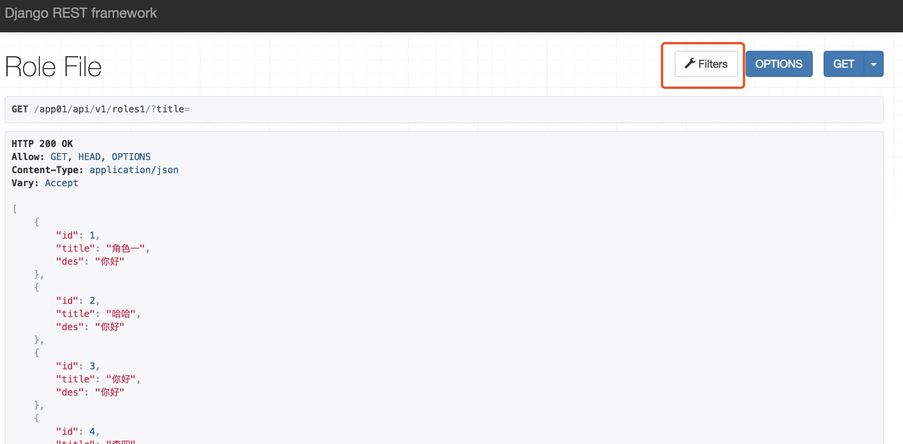
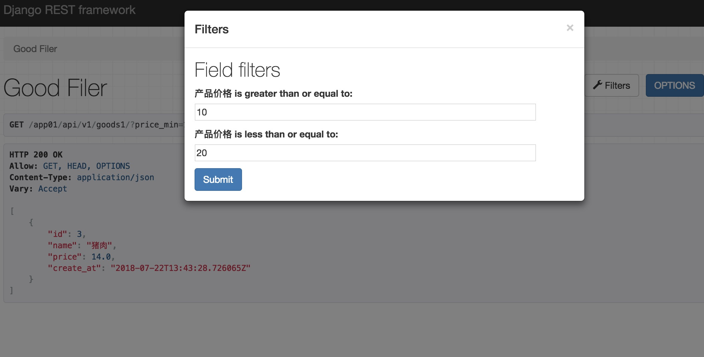

##<center>rest-framework过滤器</center>

### 一、[官网地址](http://www.django-rest-framework.org/api-guide/filtering/)

### 二、项目中常用的过滤有
* 1、基本的过滤器
* 2、搜索
* 3、排序

### 三、基本配置

* 1、安装包

  ```py
  pipenv install django-filter
  ```

* 2、注册到`app`中

  ```py
  INSTALLED_APPS = [
      'django.contrib.admin',
      'django.contrib.auth',
      'django.contrib.contenttypes',
      'django.contrib.sessions',
      'django.contrib.messages',
      'django.contrib.staticfiles',
      'rest_framework',
      'django_filters', # 注册过滤器
      'app01'
  ]
  ```

* 3、配置

  ```py
  REST_FRAMEWORK = {
      'DEFAULT_PARSER_CLASSES': ['rest_framework.parsers.JSONParser', 'rest_framework.parsers.FormParser'],
      'DEFAULT_FILTER_BACKENDS': ['django_filters.rest_framework.DjangoFilterBackend',]
  }
  ```

### 四、基本字段的过滤

* 1、在视图类中使用

  ```py
  from rest_framework.viewsets import ModelViewSet
  from django_filters.rest_framework import DjangoFilterBackend

  class RoleFileView(ModelViewSet):
      queryset = models.RoleModel.objects.all()
      serializer_class = roles.RolesSerializer
      filter_backends = [DjangoFilterBackend]
      # 定义需要过滤的字段
      filter_fields = ['title']
  ```

* 2、定义`url`

  ```py
  from django.urls import path
  from app01.views import roles

  urlpatterns = [
      path('roles/', roles.RoleView.as_view()),
      path('roles1/', roles.RoleFileView.as_view({'get': 'list'}))
  ]
  ```

* 3、可视化界面

  

### 五、自定义过滤器

* 1、创建一个产品表

  ```py
  class GoodsModel(models.Model):
      """
      创建一个产品表
      """
      name = models.CharField(max_length=100, null=False, verbose_name='产品名称')
      price = models.FloatField(verbose_name='产品价格')
      create_at = models.DateTimeField(auto_now_add=True, null=True)
  ```

* 2、插入数据

  ```sql
  mysql> select * from app01_goodsmodel;
  +----+--------+-------+----------------------------+
  | id | name   | price | create_at                  |
  +----+--------+-------+----------------------------+
  |  1 | 苹果   |   5.6 | 2018-07-22 13:43:11.734461 |
  |  2 | 鸡蛋   |   2.6 | 2018-07-22 13:43:20.982906 |
  |  3 | 猪肉   |    14 | 2018-07-22 13:43:28.726065 |
  |  4 | 牛肉   |    34 | 2018-07-22 13:43:35.895955 |
  |  5 | 南瓜   |   1.4 | 2018-07-22 13:43:42.878928 |
  +----+--------+-------+----------------------------+
  5 rows in set (0.00 sec)

  mysql> 
  ```

* 3、新建一个`filter.py`文件

  ```py
  import django_filters
  from .models import GoodsModel

  class GoodsFilter(django_filters.rest_framework.FilterSet):
      """
      自定义过滤器类
      """
      price_min = django_filters.NumberFilter(field_name='price', lookup_expr='gte')
      price_max = django_filters.NumberFilter(field_name='price', lookup_expr='lte')

      class Meta(object):
          model = GoodsModel
          fields = ['price_min', 'price_max']
  ```

* 4、在视图类中使用自定义的过滤器

  ```py
  from app01.filter import GoodsFilter
  from rest_framework.viewsets import ModelViewSet
  from django_filters.rest_framework import DjangoFilterBackend

  class GoodFilerView(ModelViewSet):
      queryset = models.GoodsModel.objects.all()
      serializer_class = goods.GoodsSerializer
      # 使用过滤器
      filter_backends = [DjangoFilterBackend]
      # 使用自定义的过滤器
      filter_class = GoodsFilter
  ```

* 5、运行界面

  


### 六、搜索功能

* 1、使用自带的搜索功能

  ```py
  from app01.filter import GoodsFilter
  from rest_framework.viewsets import ModelViewSet
  from django_filters.rest_framework import DjangoFilterBackend

  from rest_framework import filters

  class GoodFilerView(ModelViewSet):
      queryset = models.GoodsModel.objects.all()
      serializer_class = goods.GoodsSerializer
      # 使用过滤器
      # filter_backends = [DjangoFilterBackend]
      # 使用自定义的过滤器
      filter_class = GoodsFilter

      filter_backends = [DjangoFilterBackend, filters.SearchFilter, ]
      # 定义使用搜索功能
      search_fields = ['name']
  ```

### 八、排序

* 1、使用内置的排序

  ```py
  class GoodFilerView(ModelViewSet):
      queryset = models.GoodsModel.objects.all()
      serializer_class = goods.GoodsSerializer
      # 使用过滤器
      # filter_backends = [DjangoFilterBackend]
      # 使用自定义的过滤器
      filter_class = GoodsFilter
      filter_backends = [DjangoFilterBackend, filters.SearchFilter]
      # 定义使用搜索功能
      search_fields = ['name']
      # 定义排序字段
      ordering_fields = ('price', 'create_at')
  ```

