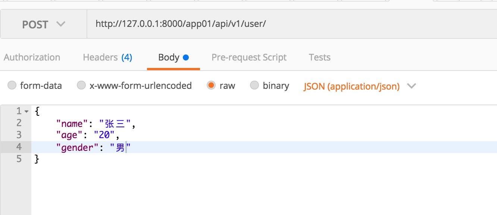
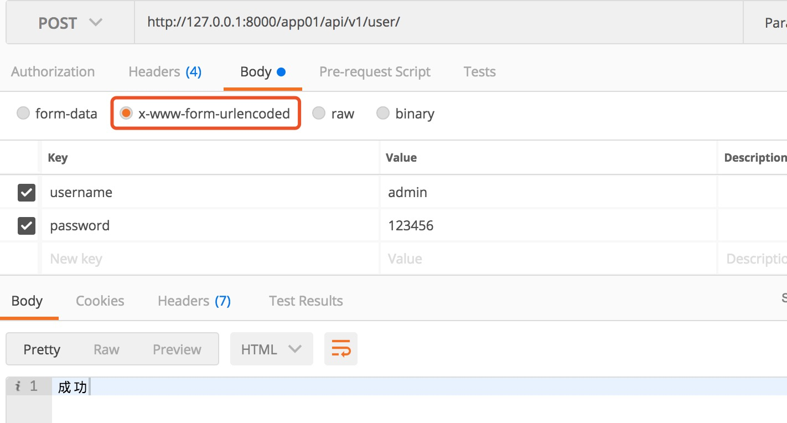

##<center>rest-framework的解析器</center>

### 一、`django`中的解析器
---
在第五章的第一小节中我们学习了`django`中的解析器,前端提交的数据模式有两种
* 1、表单模式`Content-Type: application/x-www-form-urlencoded`
* 2、`json`模式`'Content-Type': 'application/json'`


前面介绍了,我们如果在`request.POST`获取不到值就去`request.body`中获取值,但是这样很不方便,要不就跟前端约定是什么请求头,或者是后端你自己做一个判断


### 二、`rest-framework`中使用`json`提交方式

* 1、导包

  ```py
  from rest_framework.parsers import JSONParser
  ```

* 2、在视图类中使用

  ```py
  from rest_framework.parsers import JSONParser

  class User1View(APIView):
      permission_classes = []
      authentication_classes = []

      parser_classes = [JSONParser, ]

      def post(self, request, *args, **kwargs):
          print(request.data)
          return HttpResponse('成功')
  ```

* 3、提交的数据

  

* 4、后端获取到的数据

  ```json
  {'name': '张三', 'age': '20', 'gender': '男'}
  ```

### 三、使用表单提交方式

* 1、导包

  ```py
  from rest_framework.parsers import FormParser
  ```

* 2、视图类中使用

  ```py
  from rest_framework.parsers import JSONParser, FormParser

  class User1View(APIView):
      permission_classes = []
      authentication_classes = []

      parser_classes = [JSONParser, FormParser]

      def post(self, request, *args, **kwargs):
          print(request.data)
          return HttpResponse('成功')
  ```

* 3、`postman`的提交数据

  

* 4、获取到的数据

  ```json
  <QueryDict: {'username': ['admin'], 'password': ['123456']}>
  ```

### 四、兼容两种请求头提交数据模式

* 1、在`parser_classes`配置多个请求头方式

  ```py
  ...
  parser_classes = [JSONParser, FormParser]
  ...
  ```

* 2、请求头方式除了上面两种还有`MultiPartParser`和`FileUploadParser`

### 五、全局配置

```py
REST_FRAMEWORK = {
    ....
    'DEFAULT_PARSER_CLASSES': ['rest_framework.parsers.JSONParser', 'rest_framework.parsers.FormParser']
}
```