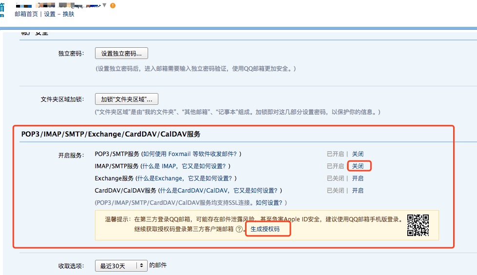

##<center>邮件的发送</center>

### 一、`django`中自带邮件发送的模块

* 1、所在包的地址

  ```py
  from django.core.mail import send_mail
  ```

* 2、关于`send_mail`参数介绍

  ```py
  """
  subject: 发送的主题,或者叫标题
  message: 发送的内容
  from_email: 发送者的邮箱
  recipient_list: 接受邮件的人(是一个list集合)
  """
  def send_mail(subject, message, from_email, recipient_list,
                fail_silently=False, auth_user=None, auth_password=None,
                connection=None, html_message=None):
      pass
  ```

### 二、在`django`使用发送邮件

* 1、以QQ邮箱为例开启`SMTP`服务

  

* 2、在`settings.py`中配置

  ```py
  # 配置发送邮件的
  EMAIL_HOST_PASSWORD = 上一步中生成的密钥  # 授权码
  EMAIL_HOST_USER = '332904234@qq.com'   # 账户邮箱
  EMAIL_HOST = 'smtp.qq.com'             # SMTP域名
  EMAIL_PORT = 25                        # 邮箱端口
  EMAIL_USE_TLS = True                   # 是否加密(默认不加密)
  EMAIL_FROM = '332904234@qq.com'        # 发送者(可以不配置)
  ```

* 3、新建一个数据模型或者使用`redis`缓存也可以的

  ```py
  class EmailVerifyRecordModel(models.Model):
      """
      创建一个邮箱验证码的模型
      """
      code = models.CharField(max_length=20, verbose_name='验证码')
      email = models.EmailField(max_length=50, verbose_name='邮箱')
      sent_type = models.CharField(max_length=20, choices=(('register', '注册'), ('forget', '忘记密码')), verbose_name='邮件类型',
                                   default='register')
      create_at = models.DateTimeField(auto_now_add=True, null=False, verbose_name='添加时间')

      class Meta(object):
          verbose_name = '邮箱验证码'
          verbose_name_plural = verbose_name

      def __str__(self):
          return self.email
  ```

* 4、自己封装一个发送邮件的方法

  ```py
  # 之前封装的生产随机数的方法
  from .random_str import random_str
  from users.models import EmailVerifyRecordModel
  from django.core import mail
  # 引入配置文件
  from django.conf import settings

  def send_email(email, sent_type='register'):
      """
      定义一个发送邮件把验证码存入到数据库中
      :param email: 接收的邮箱
      :param send_type: 发送类型
      :return:
      """
      code = random_str(16)
      EmailVerifyRecordModel.objects.create(code=code, email=email, sent_type=sent_type)

      if sent_type == 'register':
          """如果是注册的时候"""
          email_title = '欢迎你注册'
          email_body = '请点击下面链接激活你的账号:http://localhost:9000/user/action/{0}'.format(code)

          # send_mail(主题，邮件内容,发送者,接受者)
          send_status = mail.send_mail(email_title, email_body, settings.EMAIL_FROM, [email])
          if send_status:
              return True
          else:
              print('发送失败')
              return False
      elif sent_type == 'forget':
          email_title = '修改密码'
          email_body = '请点击下面链接修改你的账号密码:http://localhost:9000/user/updatePasswd/{0}'.format(code)

          # send_mail(主题，邮件内容,发送者,接受者)
          send_status = mail.send_mail(email_title, email_body, settings.EMAIL_FROM, [email])
          if send_status:
              return True
          else:
              print('发送失败')
              return False
  ```

* 5、在视图层中使用发送邮件的方法

  ```py
  class RegisterView(View):
      """
      用户注册的视图类
      """
      def get(self, request, *args, **kwargs):
          register_form = RegisterForm()
          # 把数据返回给前端
          return render(request, 'register.html', {'register_form': register_form})

      def post(self, request, *args, **kwargs):
          register_form = RegisterForm(request.POST)
          if register_form.is_valid():
              username = register_form.cleaned_data.get('email', None)
              user_obj = models.UserProfileModel.objects.filter(email=username)
              if user_obj:
                  return self.get(request, {'message': '用户名已经存在'})
              password = register_form.cleaned_data.get('password', None)
              new_password = make_password(password=password)
              # 密码加密存入数据库中
              models.UserProfileModel.objects.create(username=username, email=username, password=new_password)
              # 用户注册后发送邮件激活
              send_email(username, 'register')
              return HttpResponse('请登录邮箱激活你的账号')
          else:
              print(register_form.errors)
              return self.get(request, {'message': register_form.errors})
  ```

* 6、配置激活邮箱的地址

  ```py
  from django.urls import path, re_path
  from .views import login, register, captcha, user

  app_name = 'users'
  urlpatterns = [
      ...
      re_path('action/(?P<code>.*)/', register.ActivateEmailView.as_view()),
      ...
  ]
  ```

### 三、使用`redis`缓存来存储

* 1、在`settings.py`配置中配置`redis`的缓存
* 2、在发送邮件的时候把邮件设置到缓存中
* 3、验证的时候从缓存中取出来
