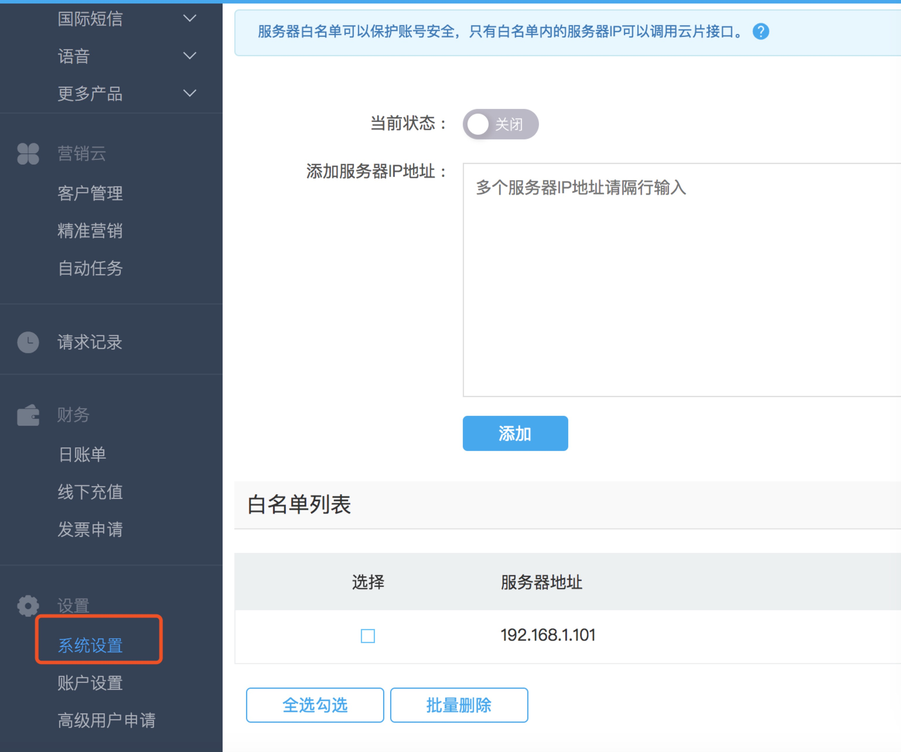

##<center>手机验证码</center>

手机短信发送本人推荐使用[阿里大于](https://dayu.aliyun.com/),只是我免费的金额已经用完,现在用[云片网](https://www.yunpian.com/)来演示.最后也会附上阿里大鱼的短信发送代码.

### 一、准备工作

* 1、注册云片网
* 2、配置签名及模板管理(必须的)

  

* 3、将你发送短信的服务器或者你本机的`ip`设置到`ip`白名单中

  

### 二、在`django`项目中新建一个`utils`的方法

* 1、在控制面板中拷贝你的`api_key`到`settings.py`文件中
* 2、关于短信发送的文档[传送门](https://www.yunpian.com/doc/zh_CN/domestic/single_send.html)
* 3、定义一个实用的类

  ```py
  from test import settings

  import requests

  class YunPianClient(object):
      """
      定义云片网发送手机短信的
      """

      def __init__(self):
          self.client = settings.YUN_PIAN_API_KEY
          self.single_send_url = 'https://sms.yunpian.com/v2/sms/single_send.json'

      def send_sms(self, moblie, code):
          params = {
              'apikey': self.client,
              'mobile': moblie,
              # 注意这个模板是要从你配置的模板中拷贝过来,不然发送会失败
              'text': '【水痕】您的验证码是{code}。如非本人操作，请忽略本短信'.format(code=code)
          }
          result = requests.post(self.single_send_url, data=params)
          return result

  if __name__ == '__main__':
      yunpian = YunPianClient()
      r = yunpian.send_sms(moblie='xxxxxx', code='1234')
      print(r.text)
      print(r.status_code)
      # {"code":0,"msg":"发送成功","count":1,"fee":0.05,"unit":"RMB","mobile":"xxx","sid":27178534084}
  ```

* 4、补充代码(生成随机数的)

```py

```