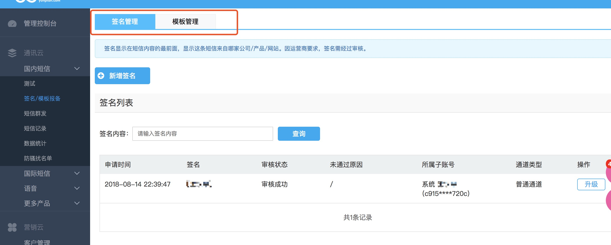

##<center>手机验证码</center>

手机短信发送本人推荐使用[阿里大于](https://dayu.aliyun.com/),只是我免费的金额已经用完,现在用[云片网](https://www.yunpian.com/)来演示.最后也会附上阿里大鱼的短信发送代码.

### 一、准备工作

* 1、注册云片网
* 2、配置签名及模板管理(必须的)

  

* 3、将你发送短信的服务器或者你本机的`ip`设置到`ip`白名单中

  

### 二、在`django`项目中新建一个`utils`的方法

* 1、在控制面板中拷贝你的`api_key`到`settings.py`文件中
* 2、关于短信发送的文档[传送门](https://www.yunpian.com/doc/zh_CN/domestic/single_send.html)
* 3、定义一个实用的类

  ```py
  import json
  from test import settings

  import requests

  class YunPianClient(object):
      """
      定义云片网发送手机短信的
      """

      def __init__(self):
          self.client = settings.YUN_PIAN_API_KEY
          self.single_send_url = 'https://sms.yunpian.com/v2/sms/single_send.json'

      def send_sms(self, moblie, code):
          params = {
              'apikey': self.client,
              'mobile': moblie,
              # 注意这个模板是要从你配置的模板中拷贝过来,不然发送会失败
              'text': '【水痕】您的验证码是{code}。如非本人操作，请忽略本短信'.format(code=code)
          }
          response = requests.post(self.single_send_url, data=params)
          return json.loads(response.text)

  if __name__ == '__main__':
      yunpian = YunPianClient()
      r = yunpian.send_sms(moblie='xxxxxx', code='1234')
      print(r.text)
      print(r.status_code)
      # {"code":0,"msg":"发送成功","count":1,"fee":0.05,"unit":"RMB","mobile":"xxx","sid":27178534084}
  ```

* 4、补充代码(生成随机数的)

  ```py
  def generate_code(self):
      """
      定义一个生成验证码的函数
      :return:
      """
      seeds = '0123456789'
      random_list = []
      for i in range(4):
          random_list.append(choice(seeds))

      return ''.join(random_list)
  ```

### 三、`django`中实现一个短信发送的功能

* 1、定义一个工具类跟上面的一样的
* 2、定义`serializer`

  ```py
  import re
  from rest_framework import serializers
  from django.conf import settings
  # 引入缓存的包
  from django.core.cache import cache

  class SmsSerializer(serializers.Serializer):
      """
      用于用户发送手机验证码的serializer类
      """
      mobile = serializers.CharField(label='手机号码', max_length=11, min_length=11, required=True,
                                    error_messages={'required': '手机号码必填', 'min_length': '手机号码格式错误',
                                                    'max_length': '手机号码格式错误'})

      def validate_mobile(self, mobile):
          """
          验证手机号码的函数
          :param mobile:
          :return:
          """

          # 判断用户是否已经注册
          if User.objects.filter(mobile=mobile).count():
              raise serializers.ValidationError('该用户已经存在')

          # 正则判断手机号码格式
          if not re.match(settings.REGEX_MOBILE, mobile):
              raise serializers.ValidationError('手机号码格式错误')

          # 缓存中获取手机号码是否在20分钟内已经发送过短信的
          if cache.get(mobile):
              raise serializers.ValidationError('手机验证码已经发送,请查收短信')

          return mobile
  ```

* 3、在视图返回

  ```py
  from rest_framework.mixins import CreateModelMixin
  from rest_framework.viewsets import GenericViewSet
  from rest_framework.response import Response
  from rest_framework import status
  from users import serializers

  from random import choice
  from utils.yun_pian_client import YunPianClient

  # 引入缓存的包
  from django.core.cache import cache

  class SmsCodeView(CreateModelMixin, GenericViewSet):
      """
      定义一个发送手机验证码的视图类
      """
      serializer_class = serializers.SmsSerializer

      @property
      def generate_code(self):
          """
          定义一个生成验证码的函数
          :return:
          """
          seeds = '0123456789'
          random_list = []
          for i in range(4):
              random_list.append(choice(seeds))

          return ''.join(random_list)

      def create(self, request, *args, **kwargs):
          """
          重写创建函数
          :param request:
          :param args:
          :param kwargs:
          :return:
          """
          serializer = self.get_serializer(data=request.data)
          serializer.is_valid(raise_exception=True)

          mobile = serializer.validated_data['mobile']
          yun_pian = YunPianClient()
          code = self.generate_code
          sms_result = yun_pian.send_sms(moblie=mobile, code=code)
          
          if sms_result['code'] != 0:
              return Response({
                  'mobile': sms_result['msg']
              }, status=status.HTTP_400_BAD_REQUEST)
          else:
              # 设置缓存
              cache.set(mobile, code)
              return Response({
                  'mobile': mobile
              }, status=status.HTTP_201_CREATED)
  ```

* 4、注册路由