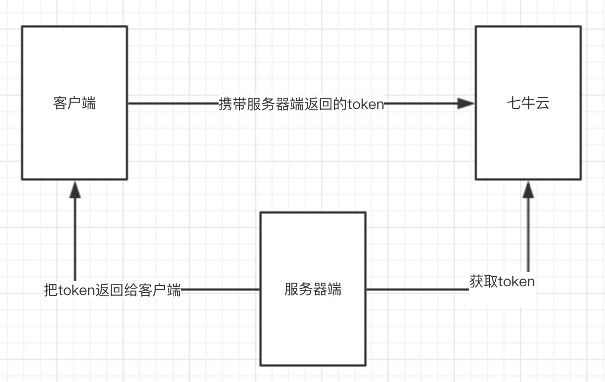
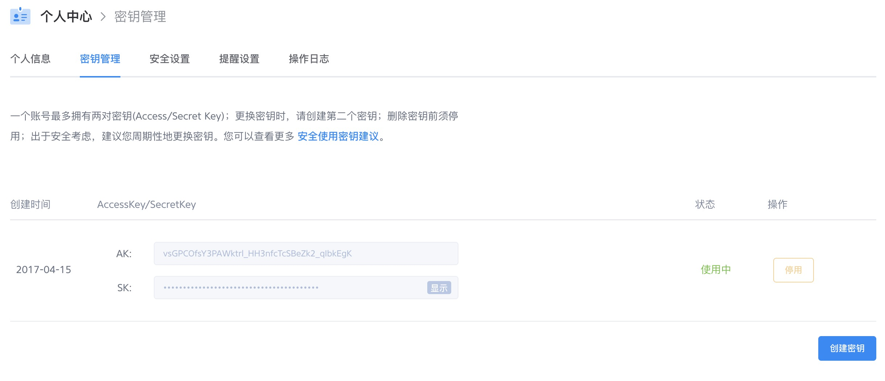
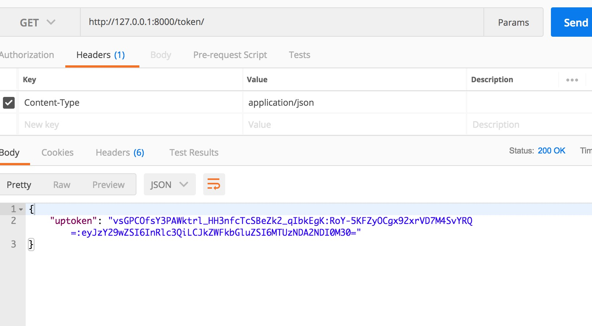

## <center>七牛云服务器的使用</center>

### 一、使用七牛云上传文件的原理

* 1、图形展示

  

* 2、基本原理思路
  * 1.服务器端先与七牛云建立连接后,会获去一个唯一识别的`token`
  * 2.把`token`返回给前端
  * 3.前端上传文件的时候携带这个`token`到七牛,七牛会对`token`进行认证


### 二、基本的配置

* 1、[注册七牛云服务器](https://www.qiniu.com/)
* 2、创建一个存储空间(默认就好)
* 3、个人面板中创建一个密钥

  

* 4、在`python`的虚拟空间中安装七牛的包,[官方文档](https://developer.qiniu.com/kodo/sdk/1242/python)

  ```py
  pip3 install qiniu
  ```

* 5、前端中的使用[文档地址](https://github.com/qiniu/js-sdk/tree/1.x)

### 三、服务器端的书写(获取`token`)

* 1、复制服务器端的`AccessKey/SecretKey`到`settings.py`中

  ```py
  # 配置七牛的AK/SK
  ACCESS_KEY_QI_NIU = 'vsGPCOfsY3PAWktrl_HH3nfcTcSBeZk2_qIEgK'
  SECRET_KEY_QI_NIU = '7IjRRkAUT2oYMzP******pR2LXq60FNae4HgwY'
  ```

* 2、定义一个视图获取`token`

  ```py
  from django.views import View
  from django.http import JsonResponse
  from django.conf import settings

  from qiniu import Auth

  class QiNiuToken(View):
      """
      定义一个获取七牛token的视图
      """

      def get(self, request, *args, **kwargs):
          # 获取认证
          q = Auth(settings.ACCESS_KEY_QI_NIU, settings.SECRET_KEY_QI_NIU)
          # 设置空间
          bucket_name = 'test'

          # 获取token
          token = q.upload_token(bucket_name)
          # 返回token
          return JsonResponse({'uptoken': token})
  ```

* 3、测试

  


### 四、客户端的书写(前端的逻辑,可以参考[文档地址](https://github.com/qiniu/js-sdk/tree/1.x))

* 1、安装七牛云`sdk`或者使用`csdn`的

  ```html
  <script src="https://cdn.staticfile.org/jquery/3.3.1/jquery.min.js"></script>
  <script src="https://cdn.staticfile.org/Plupload/2.1.1/moxie.js"></script>
  <script src="https://cdn.staticfile.org/Plupload/2.1.1/plupload.dev.js"></script>
  <script src="https://cdn.staticfile.org/qiniu-js-sdk/1.0.14-beta/qiniu.js"></script>
  ```

* 2、上传页面

  ```html
  <div id="container">
      <input type="file" id="upload">
  </div>
  ```

* 3、上传脚本的书写

  ```js
  // 初始化七牛SDK代码
  // 初始化七牛的代码必须放在选择图片行为之前,(如果不知道地址可以在后台先上传一张图片,复制地址)
  var domain = 'http://pdc7jra0s.bkt.clouddn.com/';
  var uploader = Qiniu.uploader({
      runtimes: 'html5,flash,html4', //上传模式，依次退化
      browse_button: 'upload', //上传选择的点选按钮，必须
      container: 'container',	//上传区域DOM的ID，默认是browse_button的父元素
      drop_element: 'container', //拖曳上传区域元素的ID，拖曳文件或文件夹后可触发上传
      max_file_size: '500mb', //文件最大允许的尺寸
      dragdrop: true, //是否开启拖拽上传
      chunk_size: '4mb', //分块上传时，每片的大小
      uptoken_url: '/token/', //ajax请求token的url
      domain: domain, //图片下载时候的域名
      get_new_uptoken: false, //是否每次上传文件都要从业务服务器获取token
      auto_start: true, //如果设置了true,只要选择了图片,就会自动上传
      log_level: 5, //log级别
      init: {
          'FilesAdded': function (up, files) {
              console.log('file added');
          },
          'BeforeUpload': function (up, file) {
              console.log('before upload');
          },
          'UploadProgress': function () {
              console.log('upload progress');
          },
          'FileUploaded': function (up, file, info) {
              console.log('file uploaded-----------', file);
          },
          'Error': function (up, err, errTip) {
              console.log('error:' + err);
          }
      },
  });
  ```

### 五、修复上传文件重命名

* 1、定义一个函数获取文件的后缀名

  ```js
  // 定义一个函数获取文件的后缀名
  function fileLastName(fileName) {
      if(fileName.lastIndexOf(".") == -1)
          return fileName;
      var pos = fileName.lastIndexOf(".") + 1;
      return '.' + fileName.substring(pos, fileName.length).toLowerCase();
  }
  ```

* 2、新增一个钩子函数

  ```js
  ...
  init: {
      ...
      'Key': function (up, file) {
          // 若想在前端对每个文件的key进行个性化处理，可以配置该函数
          // 该配置必须要在unique_names: false，save_key: false时才生效
          var key = +new Date(); // 对上传的文件重命名
          return key + fileLastName(file.name);
      }
  },
  ...
  ```

### 六、参考文档

* 1、[官网文档](https://developer.qiniu.com/kodo/manual/1206/put-policy)
* 2、[文档一](https://www.restran.net/2014/04/26/qiniu-js-file-upload/)
