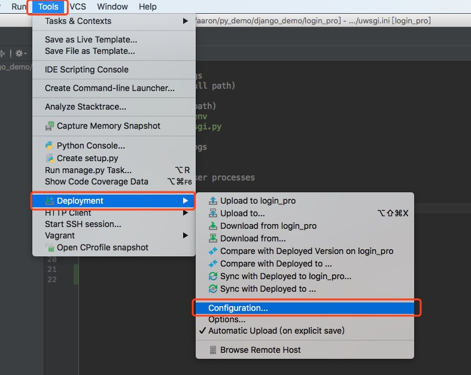
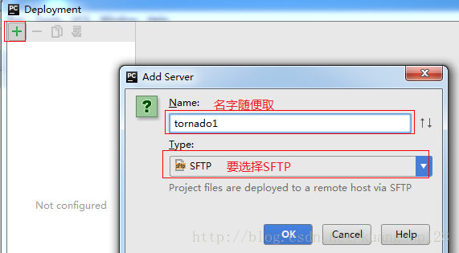
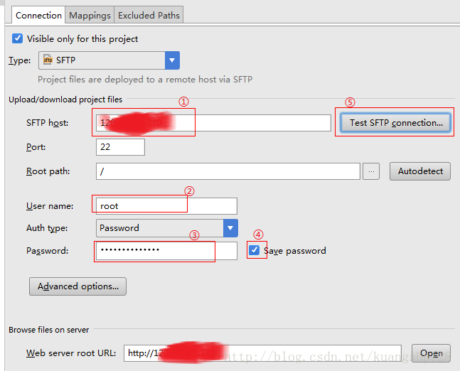
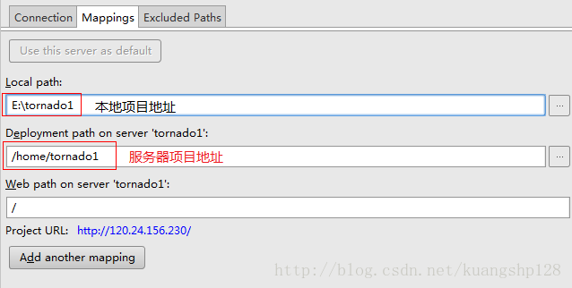
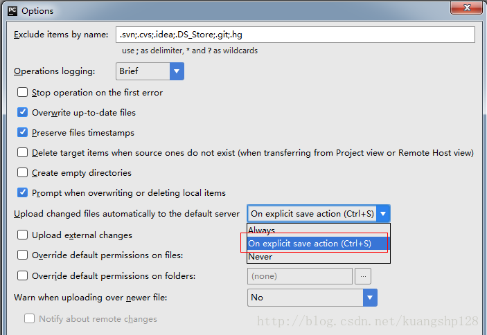
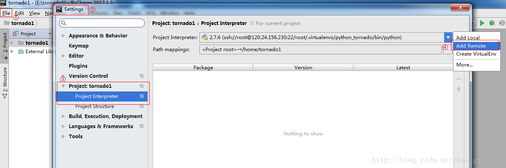
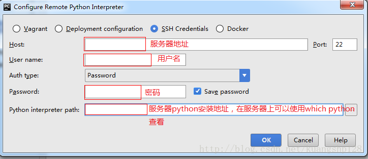
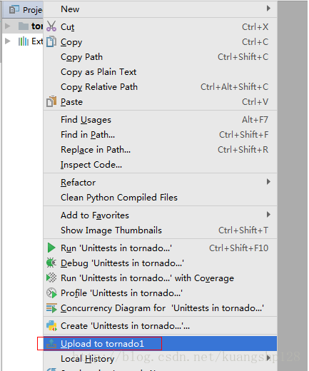

##
使用编辑器同步代码

### 一、常规的代码上传到服务器

* 1、`window`系统下可以使用`xshell`远程连接工具,完整版带了`ftp`
* 2、如果是`mac`电脑可以参考[传送门](https://blog.csdn.net/kuangshp128/article/details/81431192)
* 3、使用`git`下载代码

### 二、使用`pyCharm`编辑器自动同步代码到服务器上

> 基于上面几种方式都可以实现本地代码提交到服务器上,但是如果频繁改动的时候,或者不太习惯使用`vim`编辑器的时候,我们更希望是本地做了修改自动同步到服务器上

* 1、创建一个远程连接

  

* 2、创建一个名字
  

* 3、配置连接的用户名及密码
  

* 4、定义同步的目录
  

* 5、设置同步的方式
  

* 6、使用远程服务器的环境
  

* 7、配置用户名与密码
  

* 8、手动同步代码
  